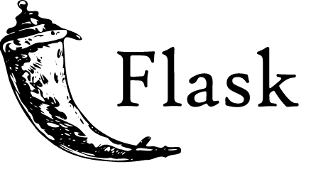
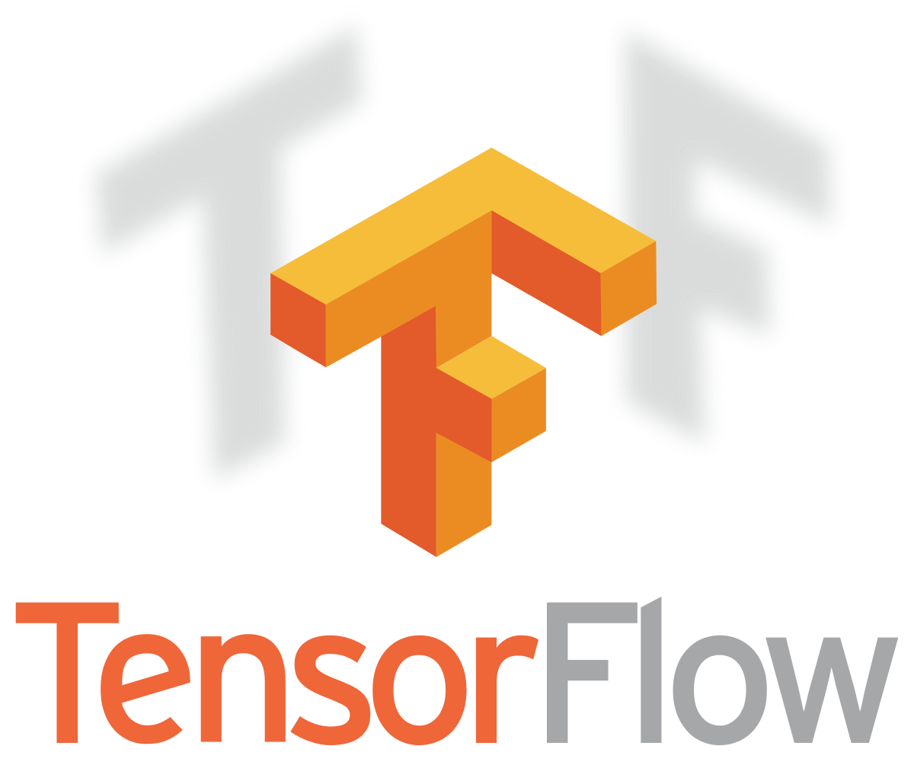
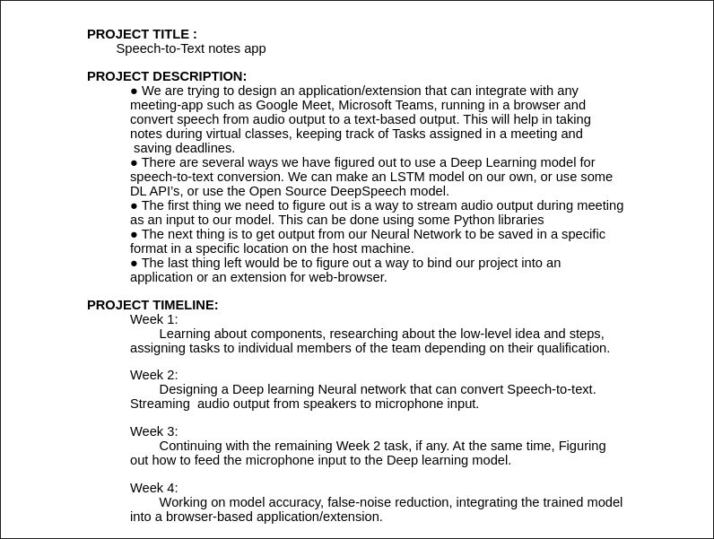

# Team Apocalypse - IEEE Mega Project
## TextronAI
The Idea is to design a computer application that is capable of running in background while converting audio output to a text-based output. This can be handy for virtual meetings where you need to cache the tasks assigned to members of your organization, to save/highlight certain deadlines, or even dislpay subtitles. We are also thinking of implementing a feature to save the video/audio for later use.

    
    
    

#### Tech Stacks:
- ElectronJS
- Python
- Flask
- Deep Learning

The Timeline as well as description can be found here: 
<!-- blank line -->

<!-- blank line -->
